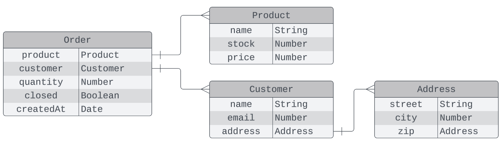

# **Express - Mongoose - Order manager API**

This project aims to showcase some of the express and mongoose features, such as database modeling, how to read and write data, routing, middleware functions, error handling, while keeping the code organized, by creating an API for a order manager service.

#

## Getting started

Clone the starter branch of this repository

```bash
git clone -b starter https://github.com/henrique-gn/express-mongoose-api.git
```

Install the depedencies

```bash
yarn add express mongoose cors dotenv
```

```bash
yarn add -D morgan @types/morgan @types/express @types/mongoose @types/cors @types/dotenv
```

#

## Database modeling

Since this is a small application we are going to use just the mongoose models, for these entities:

<br>


<br></br>

### **src/database/models/customer.ts**

```typescript
import { Schema, model } from 'mongoose'

const addressSchema = new Schema({
  street: { type: String, required: true },
  city: { type: String, required: true },
  zip: { type: String, required: true },
})

const customerSchema = new Schema({
  name: { type: String, required: true },
  email: { type: String, required: true },
  address: {
    type: addressSchema,
    required: true,
  },
})

export const Customer = model('Customer', customerSchema)
```

### **src/database/models/product.ts**

```typescript
import { Schema, model } from 'mongoose'

export const productSchema = new Schema({
  name: { type: String, required: true },
  price: { type: Number, required: true },
  stock: { type: Number, required: true },
})

export const Product = model('Product', productSchema)
```

### **src/database/models/order.ts**

```typescript
import { Schema, model } from 'mongoose'
import { productSchema } from './product'

const orderSchema = new Schema({
  product: { type: productSchema, required: true },
  quantity: { type: Number, required: true },
  customer: { type: Schema.Types.ObjectId, ref: 'Customer', required: true },
  createdAt: { type: Date, default: Date.now },
  closed: { type: Boolean, default: false },
})

export const Order = model('Order', orderSchema)
```

## Database connection

To connect to database we are going to use the URL environment variable, that we can defined in a .env file as you can see in the .env.example file.
<br></br>

### **src/database/connection.ts**

```typescript
import { connect } from 'mongoose'

export function connectDatabase() {
  const URL = process.env.MONGO_URL as string
  connect(URL)
    .then(() => console.log('Connected to database'))
    .catch(error => console.log('Error connecting to database', error))
}
```

#

## Controllers - Handling the requests

Controllers have the responsability of handle the requests sent by the client, but we also gonna implement the functionality since this is a simple app
<br></br>

### **src/http/controllers/customer.controller.ts**

```typescript
import { Customer } from '@/database/models/customer'
import e from 'express'

export async function createCustomer(req: e.Request, res: e.Response, next: e.NextFunction) {
  try {
    const { name, email, address } = req.body
    const customer = await Customer.create({ name, email, address })
    res.status(201).json(customer)
  } catch (error) {
    next(error)
  }
}

export async function listCustomers(req: e.Request, res: e.Response, next: e.NextFunction) {
  try {
    const customers = await Customer.find()
    res.status(200).json(customers)
  } catch (error) {
    next(error)
  }
}

export async function findCustomer(req: e.Request, res: e.Response, next: e.NextFunction) {
  try {
    const customer = await Customer.findById(req.params.id)
    if (!customer) {
      res.status(404).json('Customer not found')
      return
    }
    res.status(200).json(customer)
  } catch (error) {
    next(error)
  }
}

export async function updateCustomer(req: e.Request, res: e.Response, next: e.NextFunction) {
  try {
    const { id } = req.params
    await Customer.updateOne({ _id: id }, req.body)
    res.status(200).json('Customer updated')
  } catch (error) {
    next(error)
  }
}

export async function removeCustomer(req: e.Request, res: e.Response, next: e.NextFunction) {
  try {
    const { id } = req.params
    await Customer.deleteOne({ _id: id })
    res.status(204).json('Customer deleted')
  } catch (error) {
    next(error)
  }
}
```

### **src/http/controllers/product.controller.ts**

```typescript
import { Product } from '@/database/models/product'
import e from 'express'

export async function createProduct(req: e.Request, res: e.Response, next: e.NextFunction) {
  try {
    const { name, stock, price } = req.body
    const product = await Product.create({ name, stock, price })
    res.status(201).json(product)
  } catch (error) {
    next(error)
  }
}

export async function listProducts(req: e.Request, res: e.Response, next: e.NextFunction) {
  try {
    const products = await Product.find()
    res.status(200).json(products)
  } catch (error) {
    next(error)
  }
}

export async function findProduct(req: e.Request, res: e.Response, next: e.NextFunction) {
  try {
    const product = await Product.findById(req.params.id)
    if (!product) {
      return res.status(404).json({ message: 'Product not found' })
    }
    res.status(200).json(product)
  } catch (error) {
    next(error)
  }
}

export async function updateProduct(req: e.Request, res: e.Response, next: e.NextFunction) {
  try {
    const { id } = req.params
    const response = await Product.updateOne({ _id: id }, req.body)
    res.status(200).json(response)
  } catch (error) {
    next(error)
  }
}

export async function removeProduct(req: e.Request, res: e.Response, next: e.NextFunction) {
  try {
    const { id } = req.params
    const response = await Product.deleteOne({ _id: id })
    res.status(204).json(response)
  } catch (error) {
    next(error)
  }
}
```

### **src/http/controllers/order.controller.ts**

```typescript
import { Customer } from '@/database/models/customer'
import { Order } from '@/database/models/order'
import { Product } from '@/database/models/product'
import e from 'express'

export async function createOrder(req: e.Request, res: e.Response, next: e.NextFunction) {
  try {
    const { customer, product, quantity } = req.body
    const order = await Order.create({ customer, product, quantity })
    res.status(201).json(order)
  } catch (error) {
    next(error)
  }
}

export async function listOrders(req: e.Request, res: e.Response, next: e.NextFunction) {
  try {
    const orders = await Order.find()
    res.status(200).json(orders)
  } catch (error) {
    next(error)
  }
}

export async function findOrder(req: e.Request, res: e.Response, next: e.NextFunction) {
  try {
    const order = await Order.findById(req.params.id)
    res.status(200).json(order)
  } catch (error) {
    next(error)
  }
}

export async function closeOrder(req: e.Request, res: e.Response, next: e.NextFunction) {
  try {
    const { id } = req.params
    const response = await Order.updateOne({ _id: id }, { closed: true })
    if (response.modifiedCount == 0) return res.status(200).send('Order already closed')
    res.status(200).json('Order closed')
  } catch (error) {
    next(error)
  }
}
```

#

## Middlewares - verification and error handling

The use of middleware in this project is just to verify if the order is valid handle errors and setup app configs

<br/>

### **src/http/middlewares/order.middleware.ts**

```typescript
import { Customer } from '@/database/models/customer'
import { Product } from '@/database/models/product'
import { NextFunction, Request, Response } from 'express'
export async function verifyOrder(req: Request, res: Response, next: NextFunction) {
  try {
    const { customerId, productId, quantity } = req.body

    const customer = await Customer.findById(customerId)
    if (!customer) {
      return res.status(404).json('Customer not found')
    }
    const product = await Product.findById(productId)
    if (!product) {
      return res.status(404).json('Product not found')
    }
    if (product.stock < quantity) {
      return res.status(400).json('Insufficient stock')
    }
    req.body.customer = customer
    req.body.product = product

    next()
  } catch (error) {
    next(error)
  }
}
```

### **src/http/middlewares/error-handler.middleware.ts**

```typescript
import { NextFunction, Request, Response } from 'express'

export function errorHandler(error: any, req: Request, res: Response, next: NextFunction) {
  console.error(error)
  res.status(500).json({ message: 'Internal server error' })
}
```

## Applying middleware to express application

<br>

### **src/http/middlewares/index.ts**

```typescript
import cors from 'cors'
import e from 'express'
import { errorHandler } from './error-handler.middleware'
import morgan from 'morgan'

export function setupMiddleware(app: e.Application) {
  app.use(cors())
  app.use(e.json())
  app.use(morgan('dev'))
  app.use(errorHandler)
}
```

#

## Routing - Applying the controllers and middlewares to each endpoint

<br>

### **src/http/routers/customer.router.ts**

```typescript
import e from 'express'
import {
  createCustomer,
  findCustomer,
  listCustomers,
  removeCustomer,
  updateCustomer,
} from '@/http/controllers/customer.controller'

export const customerRouter = e.Router()

customerRouter
  .get('/', listCustomers)
  .get('/:id', findCustomer)
  .post('/', createCustomer)
  .patch('/:id', updateCustomer)
  .delete('/:id', removeCustomer)
```

### **src/http/routers/product.router.ts**

```typescript
import e from 'express'
import {
  createProduct,
  findProduct,
  listProducts,
  removeProduct,
  updateProduct,
} from '@/http/controllers/product.controller'

export const productRouter = e.Router()

productRouter
  .get('/', listProducts)
  .get('/:id', findProduct)
  .post('/', createProduct)
  .patch('/:id', updateProduct)
  .delete('/:id', removeProduct)
```

### **src/http/routers/order.router.ts**

```typescript
import e from 'express'
import { closeOrder, createOrder, findOrder, listOrders } from '@/http/controllers/order.controller'
import { verifyOrder } from '../middleware/order.middleware'

export const orderRouter = e.Router()

orderRouter
  .get('/', listOrders)
  .get('/:id', findOrder)
  .post('/', verifyOrder, createOrder)
  .patch('/close/:id', closeOrder)
```

## Applying the routers to express application

<br>

### **src/http/routers/index.ts**

```typescript
import e from 'express'
import { productRouter } from './product.router'
import { orderRouter } from './order.router'
import { customerRouter } from './customer.router'

export function setupRoutes(app: e.Application) {
  app.use('/api/products', productRouter)
  app.use('/api/orders', orderRouter)
  app.use('/api/customers', customerRouter)
}
```

## Setup express application and start function

<br>

### **src/http/server.ts**

```typescript
import express from 'express'
import { setupRoutes } from './routers'
import { setupMiddleware } from './middleware'

export const app = express()

setupMiddleware(app)
setupRoutes(app)

export function start() {
  const port = process.env.PORT ?? 3000
  app.listen(port, () => {
    console.log(`Server listening on port ${port}`)
  })
}
```

#

## Initialize application and services

<br>

### **src/index.ts**

```typescript
import { start } from '@/http/server'
import { connectDatabase } from '@/database/connection'
import { config } from 'dotenv'

config()
connectDatabase()
start()
```

#

## Testing

There is a "test" script in package.json you can run, make sure the application is running.

```bash
yarn test
```
